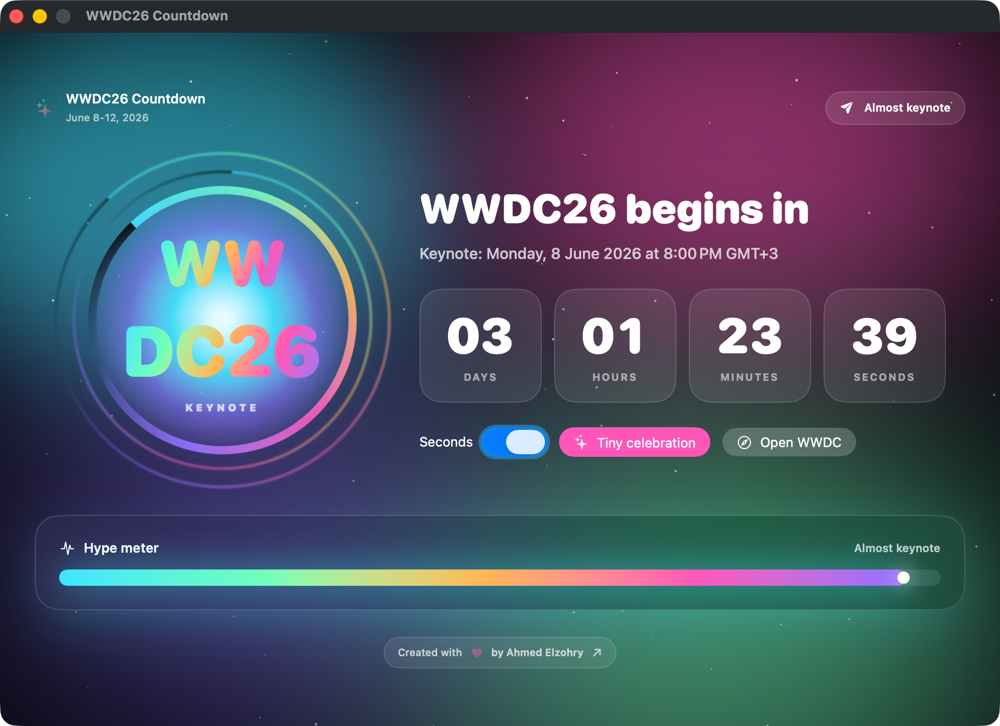

# WWDC26 Countdown

A playful SwiftUI countdown for WWDC26. It has a glowing macOS window, a Menu Bar Extra for quick glances, and a touch-friendly iOS app.

The countdown targets Apple’s WWDC26 keynote: Monday, June 8, 2026 at 10:00 a.m. PT, and displays that moment in the device’s current timezone.

## Screenshot



## Run

```sh
swift run WWDC26Countdown
```

Or open the native project in Xcode:

```sh
open WWDC26Countdown.xcodeproj
```

Select the `WWDC26Countdown` scheme and run it. The Xcode target uses local signing, so it should build and debug on this Mac without a developer team.

For iOS, select the `WWDC26Countdown iOS` scheme and run it on a simulator or device.

## Build

```sh
swift build -c release
```

## Bundle as an app

```sh
./Scripts/build-app.sh
open .build/release/WWDC26Countdown.app
```

The Xcode target and bundle script both generate a local `.icns` icon, so the app is self-contained either way.
